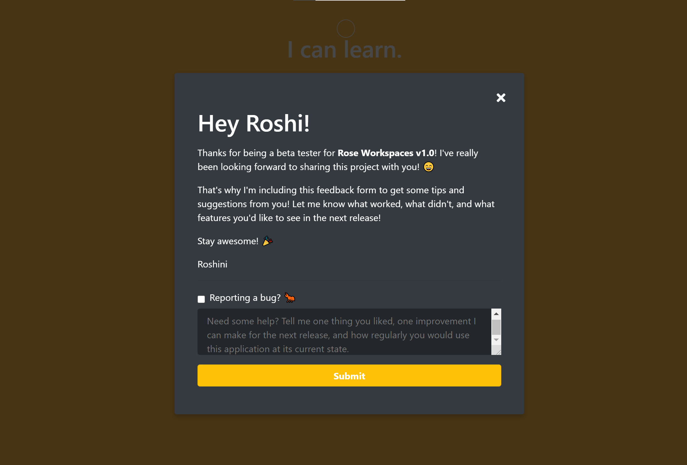

# Rose Workspaces
[Rose Workspaces v1.0](https://roseworkspaces.roshini.info) is a workspace management tool for keeping track of groups of links that can all be opened at the same time. My main goal for developing this project was to provide a central hub for students to keep track of the massive amount of course websites, docs, assignments etc. that tend to clutter our bookmarks bars.

I'd like to keep the code for this project private, but here's a visual walkthrough of the interface I designed and implemented! You can also visit the actual website and sign up for an account [here](https://roseworkspaces.roshini.info)!

## Gallery

